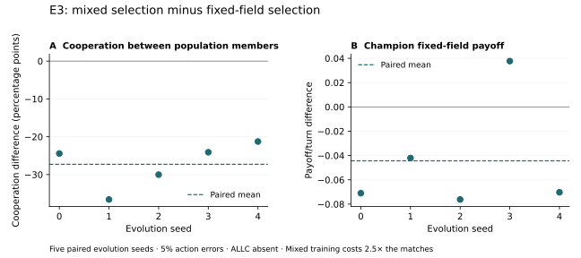

# Noise, Fitness Sampling, and Peer Selection in Evolved Cooperation

**Roland Löchli** · Working manuscript and executable research artifact

`evolution-of-cooperation` · E1, E2, and E3 completed · Exploratory results

## Abstract

When does evolutionary search discover forgiveness in the iterated Prisoner's
Dilemma, and how sensitive are its findings to the way fitness is sampled? We
study stochastic memory-one strategies represented by five cooperation
probabilities. E1 crosses action errors (0% or 5%) with the presence of an
unconditional cooperator in an otherwise fixed opponent field. E2 repeats this
design with one versus five training matches per opponent, using five paired
evolution seeds and fresh held-out evaluation. Increasing training repetitions
raises mean held-out payoff in all four E2 conditions, with substantial variation
across seeds. The clearest pattern occurs under 5% errors without an unconditional
cooperator: payoff increases in all five pairs, averaging 0.079 points per turn,
while self-cooperation falls from 53.8% to 41.8%. Noise does not increase mean
conditional forgiveness at either repetition count. E3 adds 50/50 field/peer
selection in that noisy, ALLC-absent condition. Contrary to its hypothesis,
cooperation between distinct final-population members falls in all five pairs,
from 42.9% to 15.6% on average (−27.3 percentage points; sample SD 6.1).
Champion fixed-field payoff falls by 0.044 per turn on average, with one positive
pair. Mixed selection costs 2.5 times the training matches and includes clone
interactions. These exploratory results distinguish payoff, forgiveness, and
realized cooperation; they establish neither a general coevolution effect nor
an equal-compute advantage. Code, complete populations and trajectories, match
data, and reusable vector figures accompany the manuscript.

## 1. Introduction

Axelrod's account of cooperation emphasizes that the appropriate balance between
retaliation and forgiveness depends on the opponent environment [1, pp. 119-120].
Forgiveness can interrupt continuing retaliation, but an overly forgiving
strategy can be exploited. An evolutionary experiment should therefore discover
behavior under an explicit environment rather than reward a predetermined ideal
of cooperation.

Our question is: **how do action errors, opponent composition, and training
fitness sampling affect the behavior and performance of evolved strategies?**
The current contribution is a controlled, readable computational experiment with
saved, inspectable strategies. We expose the full path from strategy probabilities
to actions, payoffs, selection, and held-out results. E2 asks whether E1's findings
persist when each fitness estimate averages more matches. E3 follows the noisy,
ALLC-absent five-match condition, asking whether selection through interactions
with the evolving population increases cooperation between its distinct members.

## 2. Related work and scope

Axelrod's book provides the substantive motivation [1]. His later work applies
genetic algorithms to evolving strategies represented by three-round lookup
tables [2]. Our repository includes a Lookup70 implementation for educational
reconstruction, but the experiments reported here use a five-probability
memory-one representation. They are contemporary extensions, not exact
replications of Axelrod's tournament field or genetic algorithm.

Nowak and Sigmund study probabilistic strategies and demonstrate circumstances
in which win-stay, lose-shift (Pavlov) outperforms TFT [3]. That work motivates
including Pavlov alongside TFT and Generous TFT as reference behaviors. Its
results do not imply that our particular opponent field must select any of them.
The present related-work discussion is focused; a submission would require a
broader comparison with research on noisy evolutionary optimization and strategy
search. The code also complements the broader
[Axelrod-Python](https://github.com/Axelrod-Python/Axelrod) ecosystem.

## 3. Model and evolutionary method

### 3.1. Game and action errors

Matches contain 80 simultaneous rounds. C denotes cooperation and D defection.
The row player's stage payoff is:

| My action / opponent action | C | D |
|---|---|---|
| C | 3 | 0 |
| D | 5 | 1 |

Each player's sampled action flips independently with probability
$\epsilon \in \{0, 0.05\}$. Both players observe realized actions. The noise model
represents action errors, not private observation errors.

### 3.2. Strategy representation

A genome is $p=(p_0,p_{CC},p_{CD},p_{DC},p_{DD})\in[0,1]^5$.

| Parameter | Probability of cooperating... |
|---|---|
| $p_0$ | On the first move |
| $p_{CC}$ | After mutual cooperation |
| $p_{CD}$ | After I cooperated and the opponent defected |
| $p_{DC}$ | After I defected and the opponent cooperated |
| $p_{DD}$ | After mutual defection |

TFT is `(1, 1, 0, 1, 0)`; Generous TFT(q=0.1) is `(1, 1, 0.1, 1, 0.1)`;
Pavlov is `(1, 1, 0, 0, 1)`; ALLD is `(0, 0, 0, 0, 0)`.
We use $p_{CD}$ as a conditional forgiveness measure. It is not an overall
cooperation rate: realized behavior depends on the other probabilities and the
states actually visited.

### 3.3. Search and fitness

The population contains 20 randomly initialized genomes, with no planted TFT.
We evaluate 35 populations: generation 0 followed by 34 breeding steps. Selection
uses tournaments of size 3. Two elites survive; offspring use blend crossover
with probability 0.7 and Gaussian mutation with standard deviation 0.06, clipped
to $[0,1]$. The same evolution seed pairs initial populations and variation RNGs
across conditions. Fitness differences can then change the selected parents.

For opponent set $O$ and $K$ training matches per opponent, training fitness is
mean total match payoff:

$$
\widehat F_K(p)=\frac{1}{|O|K}\sum_{o\in O}\sum_{r=1}^{K}\sum_{t=1}^{80}u(a_t,b_t).
$$

The seven common opponents are TFT, ALLD, Grudger, Joss(0.9), Random(0.5), Tester,
and Pavlov. ALLC is appended in the presence condition. Opponents have equal
weight within a field; adding ALLC changes common-opponent weights from 1/7 to
1/8. The comparison estimates a change in composition. E1/E2 fitness uses no peer
interaction or self-play. The reported champion is the best individual in the
final evaluated population, selected without consulting held-out results.

## 4. Experimental design

### 4.1. Questions and hypotheses

- **H1:** action errors increase evolved $p_{CD}$, helping interrupt retaliation.
- **H2:** ALLC creates opportunities for exploitation and may reduce selection
  pressure for cooperative behavior.
- **H3 (E2):** five-match fitness improves final-champion held-out payoff relative
  to one-match fitness under the same opponent distribution and noise.
- **H4 (E3):** mixed field/peer selection increases cooperation between distinct
  members of the final population relative to fixed-field selection.

These are empirical predictions, not acceptance criteria. E2 was chosen after
observing E1; it is an exploratory follow-up, not a preregistered confirmation.

### 4.2. Conditions, sampling, and cost

E1 crosses noise {0%, 5%} and ALLC {absent, present}, using one training match
per opponent. E2 adds training repetitions {1, 5}. Both use five paired evolution
seeds (0-4). E1 has 20 runs; E2 has 40 runs, including a rerun of E1's 20
one-match configurations. Those reruns are not new independent evolutionary seeds.

The five-match arm includes each one-match arm's first match seed. Training seeds
are reused by population position across generations, as in E1. E2 varies sample
count, not seed refresh policy. More sampling is intended to reduce estimation
noise; estimator variance itself is not directly measured here.

**Table 1. E2 training cost across all seeds and conditions.** Population size and
generations are fixed; the comparison does not hold compute fixed.

| Training matches per opponent | Training matches | Training rounds |
|---|---|---|
| 1 | 105,000 | 8,400,000 |
| 5 | 525,000 | 42,000,000 |

### 4.3. Held-out evaluation and analysis

Each champion is evaluated at both noise levels against the common seven
opponents, ALLC separately, and its own copy. TFT, GTFT(q=0.1), Pavlov, and ALLD
use the same evaluation schedule. Twenty match seeds per evolution seed are
shared across conditions and baselines. E2's seeds start at $2\times10^{12}$,
disjoint from E1's evaluation and from training.

The primary E2 outcome is the paired five-minus-one difference in held-out
payoff per turn against the corresponding training field at matched noise.
Self-play is excluded from this payoff. Secondary outcomes are common-field
payoff, $p_{CD}$, $p_{CC}$, and self-cooperation. We report paired means and
sample standard deviations across evolution seeds, retaining all five differences.
Matches within a seed are repeated measurements, not independent replications.

Full protocols: [E1](docs/forgiveness_e1.md), [E2](docs/forgiveness_e2.md), and
[E3](docs/forgiveness_e3.md).

### 4.4. E3: fixed-field versus mixed selection

E3 fixes noise at 5% and excludes ALLC from training. Five paired seeds (0–4)
each run fixed-field selection (field weight 1.0) and mixed selection (0.5 field
+ 0.5 peers). Both use five matches per field opponent, 20 random individuals,
35 evaluated populations, 80 rounds, and the same variation parameters from
Section 3.3. Initialization and variation RNG seeds are paired. The fixed-field
seed formula is unchanged, allowing exact comparison to E2's corresponding runs.

Mixed training evaluates all 210 unordered pairs including diagonals five times.
Distinct pairs credit both players; each diagonal uses separate clones and credits
only the first player's score once. Each individual's peer total is divided by
its actual 100 credited matches, including five diagonal scores; field payoff is
averaged over 35 matches. The normalized field and peer means receive equal
weight. The peer seed namespace starts at $10^{11}$ and is separate from field
training. Seeds remain fixed by population position and repetition across
generations, and never consume the variation RNG.

The primary outcome is final-population cooperation on a held-out off-diagonal
round robin: 190 pairs, 20 fresh matches each, averaged over both players.
Distinct members may share identical genomes. No diagonal contributes to this
outcome. Secondary measures include population mutual cooperation and payoff,
champion common-field payoff and self-cooperation, and all five champion
probabilities. Champions also face ALLC diagnostically. The champion and four
named baselines use 20 fresh matches per field opponent at 5% errors; champion
self-play also uses 20 matches. Self-cooperation uses the focal player as in E2.
Held-out domains begin at $3\times10^{12}$, are disjoint from training and E1/E2,
and share corresponding seeds across regimes. The protocol specifies every seed
formula. Held-out results do not select champions or change stopping.

Report all five mixed-minus-fixed differences, their mean, and sample SD;
each evolution seed is one replication. Fixed runs require 24,500 training
matches each; mixed runs require 61,250. The latter adds 36,750 matches (+150%,
2.5× total). This fixes population and generations, not compute. Raw training
fitness has different meanings under the two regimes and is not compared as a
common performance measure.

## 5. Results

### 5.1. E1: noise did not increase mean forgiveness

With one-match training, mean $p_{CD}$ falls from 0.254 to 0.180 without ALLC
and from 0.350 to 0.151 with ALLC when noise is introduced. These means conceal
mixed signs across seeds. The [E1 results](results/forgiveness_e1/summary.md)
contain all paired differences, baseline scores, and variability.

### 5.2. E2: extra sampling improves mean payoff, with uneven paired effects

**Table 2. E2 paired changes from one to five training matches.** Payoff uses
fresh matches against the corresponding training field at matched noise.
Parentheses give sample SD across five paired evolution seeds; pp denotes
percentage points. Positive-pair counts refer to payoff, not cooperation.

| Noise | ALLC | Payoff/turn change (SD) | Positive payoff pairs | $p_{CD}$ change | Self-cooperation change |
|---|---|---|---|---|---|
| 0% | absent | +0.004 (0.255) | 3/5 | +0.012 | -6.7 pp |
| 0% | present | +0.022 (0.050) | 3/5 | -0.085 | -4.4 pp |
| 5% | absent | +0.079 (0.060) | 5/5 | -0.037 | -12.0 pp |
| 5% | present | +0.029 (0.055) | 4/5 | -0.071 | -0.4 pp |

The noisy, ALLC-absent condition has the most consistent paired payoff increase:
mean payoff rises from 1.741 to 1.820, while self-cooperation falls from 53.8% to
41.8%. Clean, ALLC-absent results vary strongly across seeds; their near-zero
mean should not be interpreted as a precise null effect.


**Figure 1.** Five-minus-one training-repetition differences. Each dot represents
one paired evolution seed; horizontal bars mark means. Panel A uses the matching
training opponent distribution and evaluation noise. Panel B measures the genome's
conditional cooperation probability after CD. Five-match training consumes five
times as many training matches. [Vector PDF](figures/e2_paired_effects.pdf) ·
[Plot source](experiments/plot_forgiveness_e2.py) ·
[Figure data](results/forgiveness_e2/paired_differences.csv).

### 5.3. E2: the negative mean noise effect on forgiveness persists

With five-match training, mean $p_{CD}$ falls from 0.267 to 0.143 without ALLC
and from 0.265 to 0.081 with ALLC as noise rises. The respective paired mean
noise effects are -0.124 and -0.184. All five seeds show a negative noise effect
in the ALLC-present, five-match condition. H1 is not supported in these fields
and budgets; this does not establish that noise generally suppresses forgiveness.

One actual E2 champion (seed 0, five matches, 5% noise, ALLC present) is
approximately `(0.6373, 0.0000, 0.0611, 0.0000, 0.7958)`. It always intends to
defect after mutual cooperation and often cooperates after mutual defection.
This is an inspectable behavioral rule, not merely a fitness score. The full
precision vector and its trajectory are stored in
[champions.json](results/forgiveness_e2/champions.json).

### 5.4. Reference strategies and evidence

Under E2's fresh noisy evaluation on the common seven opponents, TFT scores
1.809, GTFT(q=0.1) 1.812, Pavlov 1.718, and ALLD 1.761 per turn. These are
context-specific references; comparisons must use the same evaluation field and
noise. Five seeds do not support declaring a general winner.

E2 contains 1,400 generation records, 14,400 champion evaluation matches, and
7,200 baseline evaluation matches. [Full results](results/forgiveness_e2/summary.md)
· [Per-run metrics](results/forgiveness_e2/run_metrics.csv)
· [Raw champion matches](results/forgiveness_e2/evaluation.csv)
· [Raw baseline matches](results/forgiveness_e2/baselines.csv).

### 5.5. E3: mixed selection reduced population cooperation in all five pairs

H4 is not supported in this experiment. Mean cooperation between distinct final
population members falls from 42.92% under fixed selection to 15.64% under mixed
selection. The mean paired difference is −27.28 percentage points (sample SD
6.09). Every pair decreases. Mean mutual cooperation falls from 25.75% to 6.26%
(difference −19.49 pp; SD 5.13), and population payoff falls from 2.0300 to 1.4066
per turn (difference −0.6234; SD 0.1459).

**Table 3. E3 paired mixed-minus-fixed changes.** Cooperation uses the
off-diagonal final-population round robin; payoff uses the champion against the
common seven-opponent field. All evaluation is fresh at 5% errors. Each row is
one paired evolution seed, not a match-level replication.

| Evolution seed | Population cooperation change (pp) | Champion field payoff/turn change |
|---|---|---|
| 0 | −24.424 | −0.070982 |
| 1 | −36.582 | −0.042054 |
| 2 | −30.018 | −0.076161 |
| 3 | −24.095 | +0.037679 |
| 4 | −21.265 | −0.070268 |
| Mean | −27.277 | −0.044357 |
| Sample SD | 6.093 | 0.047767 |

Mean champion common-field payoff falls from 1.8233 to 1.7789; four pairs decrease
and seed 3 increases. Champion self-cooperation falls from 42.01% to 14.73%
(difference −27.29 pp; SD 5.84). Mean champion probabilities `(p0, pCC, pCD, pDC,
pDD)` change from `(0.5308, 0.2347, 0.1427, 0.1323, 0.6002)` to
`(0.4066, 0.4100, 0.1193, 0.0009, 0.0539)`. Thus higher mean pCC coexists with
much less realized cooperation. The [generated summary](results/forgiveness_e3/summary.md)
reports all five differences and their mean/SD for every probability and outcome;
[per-run metrics](results/forgiveness_e3/run_metrics.csv) retain every champion's
five probabilities at full precision.

Against diagnostic ALLC, mean champion payoff rises from 4.2763 to 4.4995 while
focal cooperation falls from 26.23% to 14.81%. These diagnostic matches never
enter fitness. E3's common-field reference payoff is TFT 1.7944, GTFT(q=0.1)
1.8164, Pavlov 1.7274, and ALLD 1.7588. E3 uses new held-out seeds, so even the
exactly reproduced fixed champions have slightly different estimates from E2.



**Figure 2.** Mixed-minus-fixed differences for seeds 0–4. Dots are paired
evolution seeds; dashed lines are their means. Panel A excludes diagonal matches
and averages cooperation across both players. Panel B evaluates the final
champion on the common field. Mixed training includes clones and costs 2.5× as
many matches. [Vector PDF](figures/e3_paired_effects.pdf) ·
[Plot source](experiments/plot_forgiveness_e3.py) ·
[Figure data](results/forgiveness_e3/paired_differences.csv).

E3 saves 350 generation records, 200 final genomes, 38,000 population evaluation
matches, 1,800 champion matches, and 2,800 baseline matches. Executed counters
verify 122,500 fixed and 306,250 mixed training matches across five runs each
(428,750 total; 34,300,000 rounds). Training took 22.59 seconds fixed and 63.28
seconds mixed, an additional 40.70 seconds on this machine. Including evaluation
and output, the full runner took 95.98 seconds; verification replay is extra.
Wall time is descriptive and machine dependent. [Manifest](results/forgiveness_e3/manifest.json)
· [Full populations](results/forgiveness_e3/populations.json)
· [Raw population matches](results/forgiveness_e3/population_evaluation.csv)
· [Raw champion matches](results/forgiveness_e3/evaluation.csv)
· [Raw baseline matches](results/forgiveness_e3/baselines.csv).

## 6. Discussion

The results distinguish performance against a fixed opponent field from
cooperation among copies of the evolved strategy. More training sampling can
improve the former while reducing the latter. This is compatible with the
E1/E2 fitness objective: selection rewards individual payoff against the field and
contains no direct reward for cooperative self-play.

E2 suggests that E1's negative mean noise effect on conditional forgiveness was
not solely a consequence of using one training match. It does not establish the
mechanism responsible. Opponent composition, representation, repeated training
seeds, and the search budget remain plausible influences. The conditional nature
of forgiveness in Axelrod's discussion motivates examining these environments;
the pilot does not test the book's broader social or political claims.

E3 shows that simply adding individual-payoff selection through peers does not
ensure more cooperative population behavior. In this complete mixed regime,
cooperation decreases in every pair despite the extra training cost. Four mixed
champions have very small pDD and all have pDC near zero; these rules provide few
intended cooperative moves after mutual defection or after exploiting a
cooperator. Seed 3 retains pCC=1 and much higher population cooperation than the
other mixed runs, yet still decreases relative to its paired fixed run. These
descriptions are consistent with the measured behavior; they do not identify a
causal mechanism or establish that peer selection generally suppresses cooperation.

## 7. Limitations

Five evolution seeds and 35 evaluated populations provide exploratory evidence.
We do not estimate asymptotic performance, report significance claims, or equate
repeated match observations with independent searches. Five-match training costs
five times more; no equal-compute advantage is established. Fixed position-indexed
training seeds may permit adaptation to sampled matches. We have not measured
fitness-estimator variance or tested refreshed training seeds.

The opponent field is deliberately small and is not a representative sample of
all possible strategies. Adding ALLC changes normalized opponent weights. The
five-probability representation limits available behavior; $p_{CD}$ alone does
not capture generosity, state occupancy, or overall cooperation. Nearest-reference
names describe L1 vector distance, not behavioral equivalence. Earlier
[legacy summaries](artifacts/README.md) are retained with explicit provenance
limits and are not treated as verified replication evidence.

E3 adds just five paired seeds in the condition selected after observing E2.
Its clone-inclusive peer training estimates the complete mixed-selection regime;
it cannot separate selection through distinct peers from selection through one's
copy. The primary evaluation excludes diagonals, but this does not remove the
training confound. E3's 2.5× match budget, fixed position seeds, finite population,
and single noise level preclude equal-compute or general claims about coevolution.
It does not test long-term stability or spatial invasion.

## 8. Conclusion and next experiment

Under the tested conditions, averaging more training matches modestly improves
mean held-out payoff while leaving the negative mean noise effect on forgiveness
intact. Higher payoff can coexist with less cooperation. E3's defined mixed
field/peer regime instead reduces population cooperation in all five pairs and
reduces mean champion field payoff. The primary hypothesis was allowed to fail.
E3 is complete, and this experiment stops here. The roadmap's next substantive
step remains E4: test selected, inspected saved strategies in the existing spatial
lattice with matched starting grids. That requires a separate protocol and has
not been implemented or run in this update.

## References

1. Axelrod, R. (1984). *The Evolution of Cooperation*. Basic Books.
2. Axelrod, R. (1987). The evolution of strategies in the iterated Prisoner's
   Dilemma. In L. Davis (Ed.), *Genetic Algorithms and Simulated Annealing*,
   pp. 32-41. Morgan Kaufmann.
   [Author's later adapted chapter](https://www.cse.unr.edu/~simingl/papers/DSA/Evolving%20New%20Strategies%20Iterated%20Prisoner%20Dilemma.pdf).
3. Nowak, M., & Sigmund, K. (1993). A strategy of win-stay, lose-shift that
   outperforms tit-for-tat in the Prisoner's Dilemma game. *Nature*, 364, 56-58.
   [doi:10.1038/364056a0](https://doi.org/10.1038/364056a0).

[BibTeX bibliography](references.bib). Cite this computational artifact using
`ReloadLightly/evolution-of-cooperation`, the experiment ID, and the exact commit.
This working manuscript has not been submitted or peer reviewed.

## Appendix A. Reproducibility and learning from the code

The experiment and inspection scripts require only Python 3.10+ standard library;
no API keys or paid services. From the repository root, inspect a saved E2 strategy:

```bash
python3 examples/inspect_memory_one.py --results results/forgiveness_e2/champions.json --run 7 --turns 20
```

Watch a small E2 run live, then inspect the newly evolved five-match champion:

```bash
RUN_DIR="artifacts/forgiveness_e2_live_$(date +%Y%m%d_%H%M%S)"
python3 -u experiments/run_forgiveness_e2.py --seeds 0 --generations 5 --eval-reps 3 --output "$RUN_DIR"
python3 examples/inspect_memory_one.py --results "$RUN_DIR/champions.json" --run 7
```

For the complete 40-run E2 experiment:

```bash
python3 -u experiments/run_forgiveness_e2.py --output artifacts/forgiveness_e2_live_full
```

Each output directory must be new or empty. Records are ordered by seed, then
training repetitions (1, 5), noise (0, 0.05), and ALLC (absent, present).
The [E1 runner](experiments/run_forgiveness.py) and E1 outputs remain unchanged.

For a short E3 replay and round-by-round inspection in the VS Code terminal:

```bash
RUN_DIR="artifacts/forgiveness_e3_short_$(date +%Y%m%d_%H%M%S)"
python3.12 -u experiments/run_forgiveness_e3.py --seeds 0 --generations 5 --eval-reps 3 --output "$RUN_DIR"
python3.12 examples/inspect_memory_one.py --results "$RUN_DIR/champions.json" --run 1 --turns 20
python3.12 examples/inspect_memory_one.py --results results/forgiveness_e3/champions.json --run 1 --turns 20
```

E3 records are ordered by seed, then fixed and mixed; record 1 is seed 0 mixed.
Use Python 3.12.13 for exact reproduction of the published histories.
The short replay reduces the search and evaluation budgets; it does not recreate
the full-run champion. To reproduce all ten runs or verify the saved full results
and exactly replay seed 0 mixed, respectively:

```bash
python3.12 -u experiments/run_forgiveness_e3.py --output artifacts/forgiveness_e3_full_replay
python3.12 -u experiments/verify_forgiveness_e3.py
```

The verifier compares every fixed champion/history with E2, recomputes metrics,
checks source hashes and counts, and replays seed 0 mixed with all its held-out
measurements. It writes `verification.json` and `replay.log` in the result folder.
Execution uses no added dependencies. Figure generation uses the existing
Matplotlib dependency: `python3.12 experiments/plot_forgiveness_e3.py`.

For E3's Python changes, inspect
[`MemoryOneGA._peer_scores()`](src/eoc/evolve_m1.py) for repetitions and diagonal
crediting, then `train_run()`, `evaluate_population()`, and `run_metrics()` in the
[E3 runner](experiments/run_forgiveness_e3.py). The runner reuses E1's match
measurement helper. [E3 tests](tests/test_forgiveness_e3.py) give small numerical
examples of normalization, weights, and replay.

Follow the execution through
[`MemoryOne.strategy()`](src/eoc/genomes.py),
[`Match.play()`](src/eoc/game.py),
[`MemoryOneGA.evaluate()` and `breed()`](src/eoc/evolve_m1.py), and the
[E2 runner](experiments/run_forgiveness_e2.py).

For tests and figure generation:

```bash
python3.12 -m venv .venv
source .venv/bin/activate
python -m pip install -e '.[dev]'
python -m pytest -q
python experiments/plot_forgiveness_e2.py
```

**Validation:** 41 tests pass. All 20 E2 one-match champions and complete histories
exactly reproduce E1. A five-match run replays its champion, all 35 generation
records, and 360 evaluation matches exactly. Source/protocol hashes match the
executed files; the [E2 manifest](results/forgiveness_e2/manifest.json) records
parameters, Python version, and the base commit. The base commit may precede local
edits; hashes identify the code actually run.

**E3 validation:** 55 tests pass, including repetition counts, legacy peer seeds,
diagonal crediting, normalized weights, held-out domains, and deterministic replay.
All five E3 fixed champions and all their histories exactly reproduce the matching
E2 configurations. Seed 0 mixed exactly replays its champion, 35 history records,
20 final genomes, 3,800 population matches, 180 champion matches, and 560 baseline
matches. All saved metrics and paired differences are recomputed from raw data.
[Verification evidence](results/forgiveness_e3/verification.json) records the
checks, exact data hashes, and replay time; the protocol/source hashes match the
executed code. E1/E2 outputs remain unchanged.

The [execution notes](results/forgiveness_e3/verification.md) document the initial
Python 3.10 runtime mismatch, its rerun, smoke checks, and verification cost.
Python 3.12.13 matches E2's floating-point history records exactly.

## Appendix B. Manuscript development and experiment sequence

The README is the canonical manuscript narrative. Tables point to saved data;
Figure 1 is available as PDF/SVG/PNG; references are maintained in BibTeX. The
[manuscript map](docs/manuscript.md) identifies what can be transferred into an
article document when the evidence warrants submission. The
[experiment roadmap](docs/ROADMAP.md) records the completed E1–E3 experiments
and leaves E4 spatial cooperation as a separate, unexecuted step.
